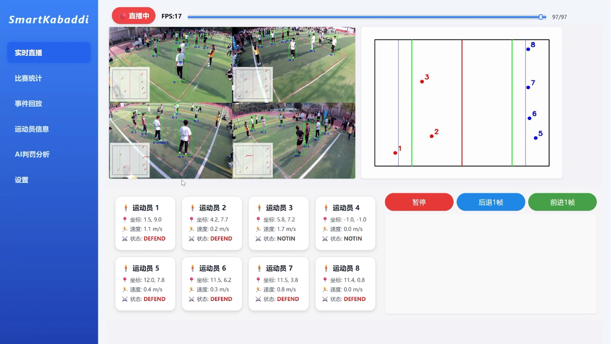
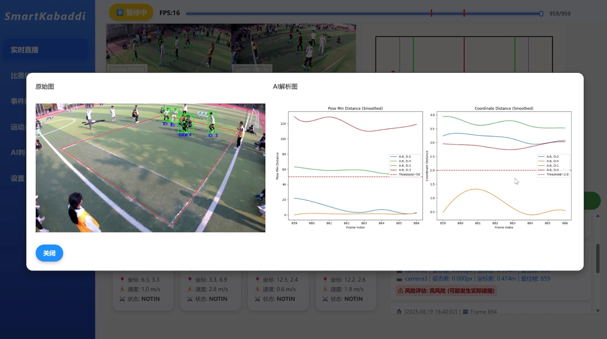
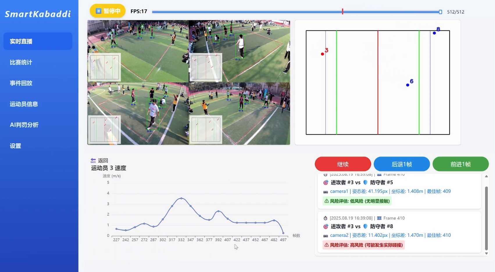
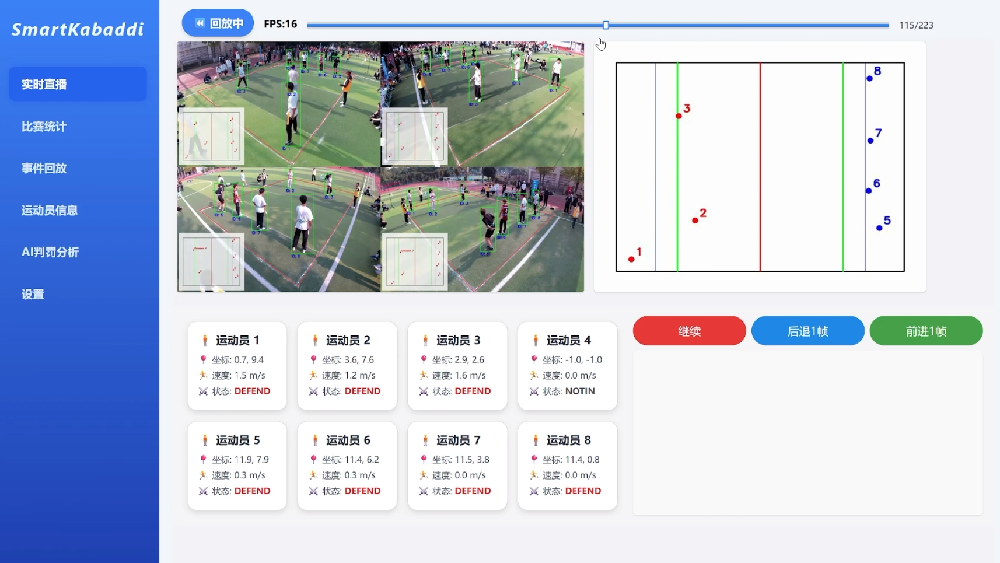
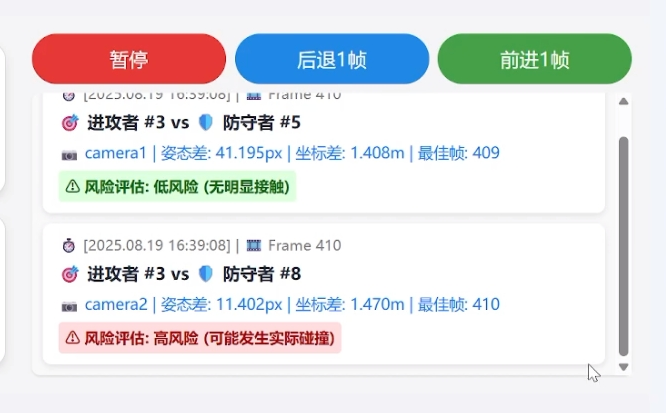
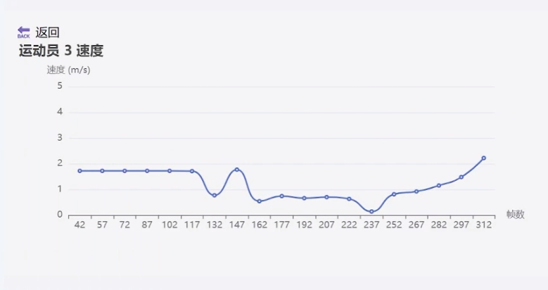
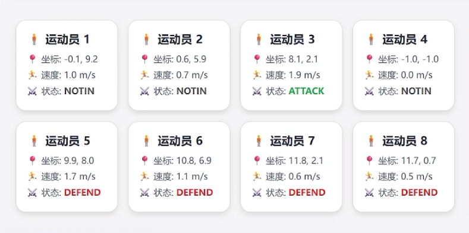

# SmartKabaddi - Intelligent Referee System for Kabaddi

A Vue 3 + Vite frontend application for the SmartKabaddi intelligent referee system. Leveraging computer vision and AI to provide real-time match streaming, athlete analysis, AI-powered referee assistance, and data visualization for Kabaddi matches.

## Core Features

### Live Match Streaming
Multi-channel video stream ingestion with real-time overlay of athlete key metrics and match event markers. Supports frame-level historical backtracking.



### AI Referee Analysis
AI models automatically detect fouls from match frames and provide penalty recommendations with decision rationale, assisting referees in making fast and accurate calls.



### Pause Analysis & Replay
Automatically captures key frames during match pauses for side-by-side image comparison. Supports click-and-drag replay for precise navigation to disputed moments.





### Key Event Alerts
Automatically identifies and marks critical match events (scoring, fouls, timeouts, etc.), displayed as a timeline. Click any event to jump to the corresponding frame.



### Real-time Athlete Speed
Tracks on-court athlete movement speed in real time via object tracking, visualized as dynamic line charts showing speed trends.



### Athlete Status Monitoring
Real-time display of athlete metrics including fitness data, position info, and play duration.



## Tech Stack

| Category | Technology |
|----------|-------------|
| Framework | Vue 3 (Composition API + `<script setup>`) |
| Build Tool | Vite |
| UI Library | Naive UI |
| CSS Framework | Tailwind CSS |
| Routing | Vue Router 4 |
| Data Visualization | ECharts / vue-echarts, Chart.js / vue-chartjs |
| HTTP Client | Axios |

## Project Structure

```
kabaddi-referee-frontend/
├── assets/                    # Screenshots & static assets
├── src/
│   ├── components/            # Shared components
│   │   ├── Sidebar.vue        # Navigation sidebar
│   │   ├── PlayerCard.vue     # Athlete info card
│   │   ├── PlayerSpeedChart.vue # Athlete speed chart
│   │   └── SmartAssessment.vue  # AI assessment component
│   ├── pages/                 # Page components
│   │   ├── LivePage.vue       # Live streaming page
│   │   ├── StatsPage.vue      # Match statistics page
│   │   ├── EventsPage.vue     # Event replay page
│   │   ├── PlayersPage.vue    # Athlete info page
│   │   ├── AIAnalysisPage.vue # AI referee analysis page
│   │   └── SettingsPage.vue   # Settings page
│   ├── views/                 # View components
│   │   ├── LiveView.vue       # Live view
│   │   ├── MatchStats.vue     # Match stats view
│   │   └── KeyframeCluster.vue# Keyframe cluster view
│   ├── router/
│   │   └── index.js           # Route configuration
│   ├── App.vue                # Root component
│   └── main.js                # Entry point
├── index.html
├── package.json
├── vite.config.js
├── tailwind.config.js
└── postcss.config.js
```

## Getting Started

### Prerequisites

- Node.js >= 18
- npm >= 9

### Installation & Running

```bash
# Install dependencies
npm install

# Start development server
npm run dev

# Build for production
npm run build

# Preview production build
npm run preview
```

The dev server runs at `http://localhost:5173` by default. Backend API and video streaming services must be started separately.

## Page Overview

| Page | Description |
|------|-------------|
| Live | Match video streaming, athlete cards, speed charts, event markers |
| Match Stats | Scores, offensive/defensive data, team statistics |
| Event Replay | Keyframe cluster browsing, match event timeline review |
| Athletes | Player list with detailed status data |
| AI Analysis | AI-assisted penalty recommendations, decision rationale visualization |
| Settings | System parameter configuration |
